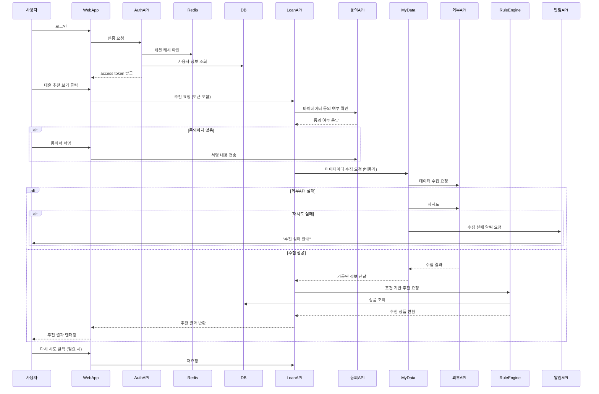

```mermaid
sequenceDiagram
    participant 사용자
    participant WebApp
    participant AuthAPI
    participant Redis
    participant DB
    participant LoanAPI
    participant 동의API
    participant MyData
    participant 외부API
    participant RuleEngine
    participant 알림API

    사용자->>WebApp: 로그인
    WebApp->>AuthAPI: 인증 요청
    AuthAPI->>Redis: 세션 캐시 확인
    AuthAPI->>DB: 사용자 정보 조회
    AuthAPI-->>WebApp: access token 발급

    사용자->>WebApp: 대출 추천 보기 클릭
    WebApp->>LoanAPI: 추천 요청 (토큰 포함)
    LoanAPI->>동의API: 마이데이터 동의 여부 확인
    동의API-->>LoanAPI: 동의 여부 응답

    alt 동의하지 않음
        사용자->>WebApp: 동의서 서명
        WebApp->>동의API: 서명 내용 전송
    end

    LoanAPI->>MyData: 마이데이터 수집 요청 (비동기)
    MyData->>외부API: 데이터 수집 요청
    alt 외부API 실패
        MyData->>외부API: 재시도
        alt 재시도 실패
            MyData->>알림API: 수집 실패 알림 요청
            알림API->>사용자: "수집 실패 안내"
        end
    else 수집 성공
        외부API-->>MyData: 수집 결과
        MyData-->>LoanAPI: 가공된 정보 전달
        LoanAPI->>RuleEngine: 조건 기반 추천 요청
        RuleEngine->>DB: 상품 조회
        RuleEngine-->>LoanAPI: 추천 상품 반환
        LoanAPI-->>WebApp: 추천 결과 반환
        WebApp-->>사용자: 추천 결과 렌더링
    end

    사용자->>WebApp: 다시 시도 클릭 (필요 시)
    WebApp->>LoanAPI: 재요청

```
